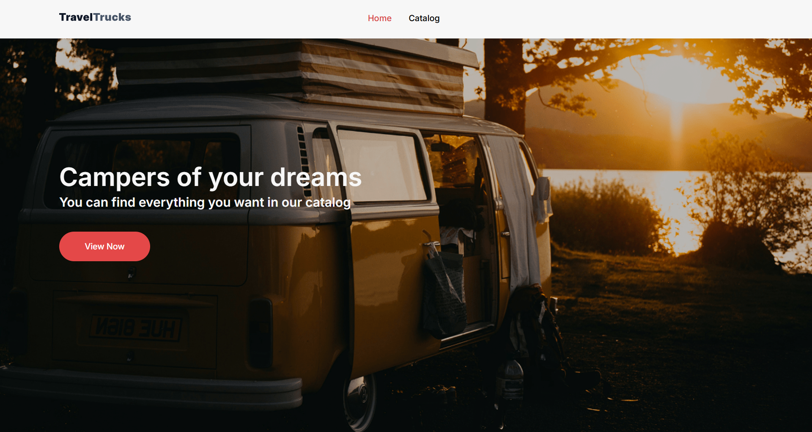
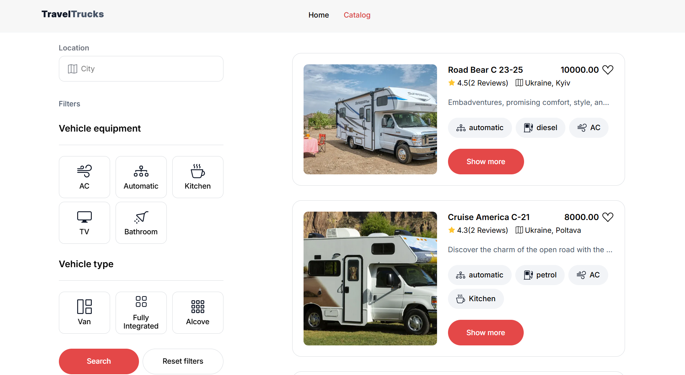
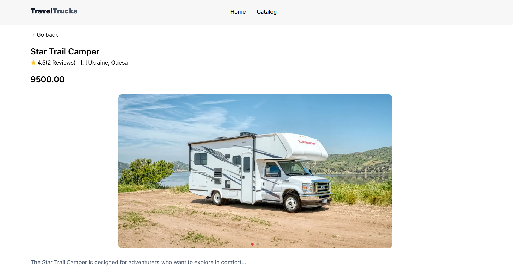
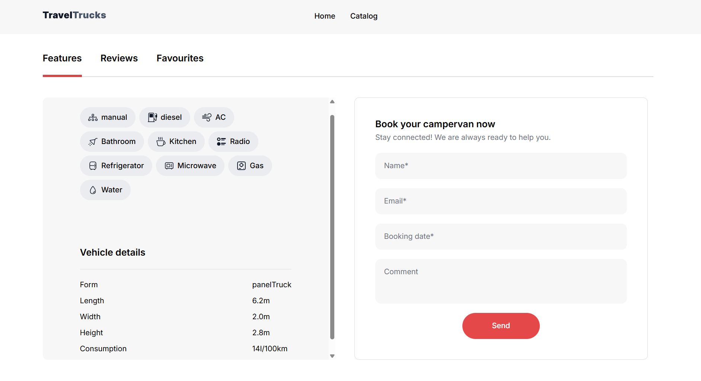

# 🚐 TravelTrucks

A web application for **TravelTrucks**, a company that rents campers.  
Users can browse the camper catalog, filter results, add campers to favorites, view detailed information with reviews, and make bookings.  

🔗 [Live Demo](https://travel-trucks-eosin-iota.vercel.app/)  

---

## ✨ Features
- 🏠 **Home page** with a banner and CTA button leading to the catalog  




- 📑 **Camper catalog** with:
  - filtering (location, vehicle type, AC, kitchen, and more)  
  - **Load More** button to fetch additional campers  
  - ability to add campers to **favorites** (saved even after refresh)  



- 🚐 **Single camper page**:
  - photo gallery  
  - specifications (transmission, engine, AC, kitchen, bathroom, etc.)  
  - technical details (form, length, width, tank, fuel consumption, etc.)  
  - user reviews with a 5-star rating ⭐  
  - booking form with a success notification  




- 🔗 Routing:  
  - `/` — Home page  
  - `/catalog` — Catalog  
  - `/catalog/:id` — Camper details  

---

## 🛠️ Tech Stack
- ⚡ **Vite** + **React**  
- 🔄 **Redux** for state management  
- 🌐 **React Router** for routing  
- 📡 **Axios** for API requests  
- 🎨 CSS Modules

---

## 🚀 Run Locally

1. Clone the repository:
   ```bash
   git clone https://github.com/sofi-dobriak/travel-trucks.git
2. Navigate to the project folder:
    ```bash
    cd travel-trucks
3. Install dependencies:
    ```bash
    npm install
4. Start the development server:
    ```bash
    npm run dev

5. Open in your browser:
    ```bash
    http://localhost:5173
---

👩‍💻 Author: Sofi Dobriak